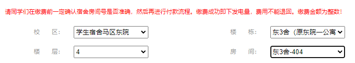
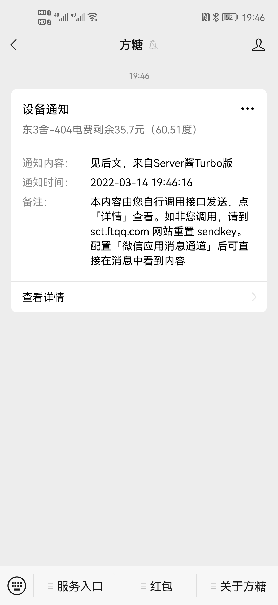
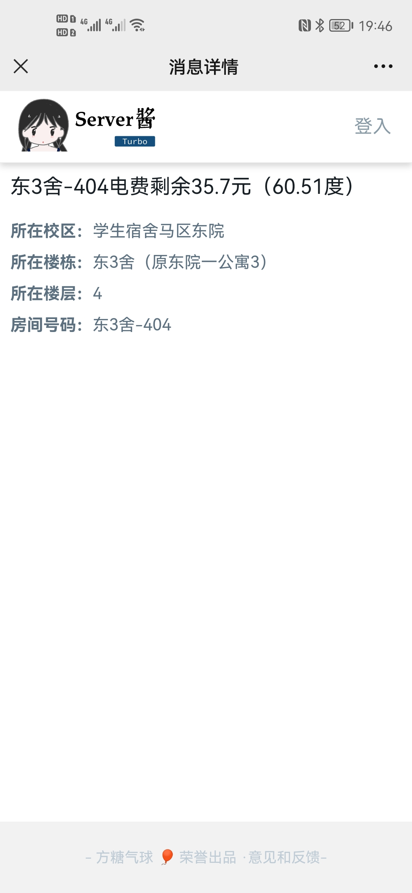
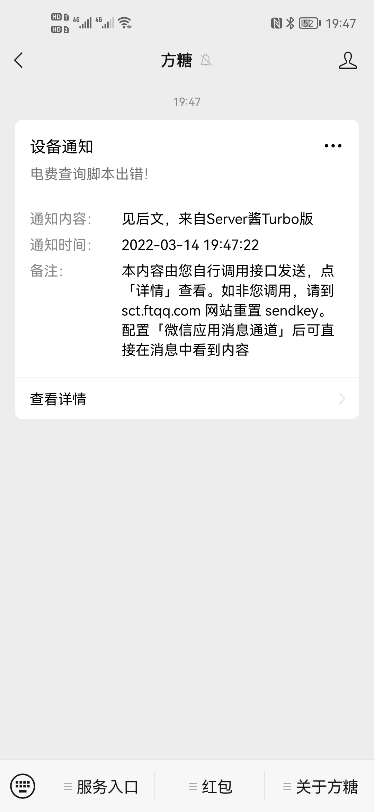

# Whut_electric
Whut_electric是一个基于Python3编写的Linux爬虫程序，通过chromedriver和selenium模拟点击并爬取武汉理工大学马房山校区学生宿舍电费余额，用ServerChan进行消息推送  
  
**注意：** 本项目依赖的在线推送服务Server酱Turbo已开启会员订阅制度，免费账户单日推送信息数量可能受限！

## 建议运行环境

VPS、软路由、树莓派等**安装Linux发行版本且便于24小时运行的设备**

## 兼容性测试

|  兼容性   | 系统  | 设备  |
|  ----  | ----  |----  |
| :white_check_mark:  | Ubuntu 18.04 | VMware虚拟机 |
| :white_check_mark:  | Debian 11 | 树莓派RaspberryPi 4B|
| :white_check_mark:  | Armbian 5.77 | 斐讯Phicomm N1|
| :white_check_mark:  | Ubuntu 18.04 | 香橙派OrangePi PC 2|
| :x:  | Windows | x64计算机|

## 文件清单

|  文件   | 说明  |
|  ----  | ----  |
| Whut_electric.ipynb  | Google Colab项目，用于在线编写、调试和提交 |
| whut_electric.py  | py脚本文件，用于本地执行 |

## 依赖环境组件

|  Python组件   | 说明  |
|  ----  | ----  |
| selenium  | 用于模拟用户点击 |
| re  | 用于处理带小数点的字符串数值 |
| requests  | 用于向Server酱发起推送请求 |
| urllib.parse  | 用于进行URL特殊字符编码 |
  
|  系统组件   | 说明  |
|  ----  | ----  |
|  chromium-chromedriver  | 用于控制chromium访问网页  |

## 配置说明
### 申请Server酱API接口
1. 注册[Server酱Turbo](https://sct.ftqq.com/)账户，获取SendKey。
2. 在[消息通道](https://sct.ftqq.com/forward)中设置需要推送的途径，保存后进行发送测试，确认推送消息能够送达。  

### 下载执行脚本并编辑
1. 将**whut_electric.py**下载到指定的Linux设备上，并赋予执行权限(755)
```
chmod 755 whut_electric.py
```  
  
2. 登陆[武汉理工大学缴费平台](http://cwsf.whut.edu.cn/)，进入**马房山学生电费**，将自己的宿舍信息（校区、楼栋、楼层和房间号）**一字不差**地复制或记录下来
  
  
3. 编辑**whut_electric.py**，将宿舍信息和从Server酱处获得的Sendkey粘贴到**个人信息参数**的对应部分，可根据情况修改当日电价便于精确计算剩余度数
```
"""# 填入个人信息参数"""

# 填入个人学号
usercode = "012*********6"
# 填入缴费平台密码
passwd = "******"
# 校区
area = "学生宿舍马区东院"
# 楼栋
building = "东3舍（原东院一公寓3）"
# 楼层
floor = "4"
# 房间
room = "东3舍-404"
# 当前电价
price = 0.59
# 填入通过Serverchan获取的sendkey
key = "**********************************"
```  
### 安装依赖环境

```
pip3 install selenium
pip3 install requests
apt-get update 
apt install chromium-chromedriver
```

## 运行说明
直接调用编辑完成的py脚本即可
```
python3 whut_electric.py
```  
  
可通过crontab定时任务实现每日/周/月推送消息

## 效果展示（以微信方糖服务号为例）
  

## 开源协议
本项目使用[Apache License 2.0](https://github.com/Stalker-404/Whut_electric/blob/main/LICENSE)开源许可证
